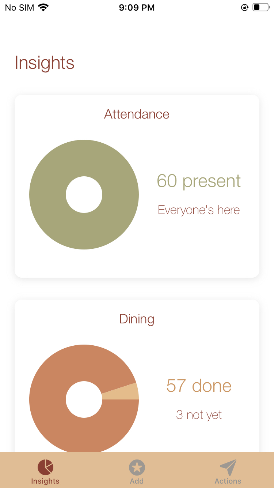
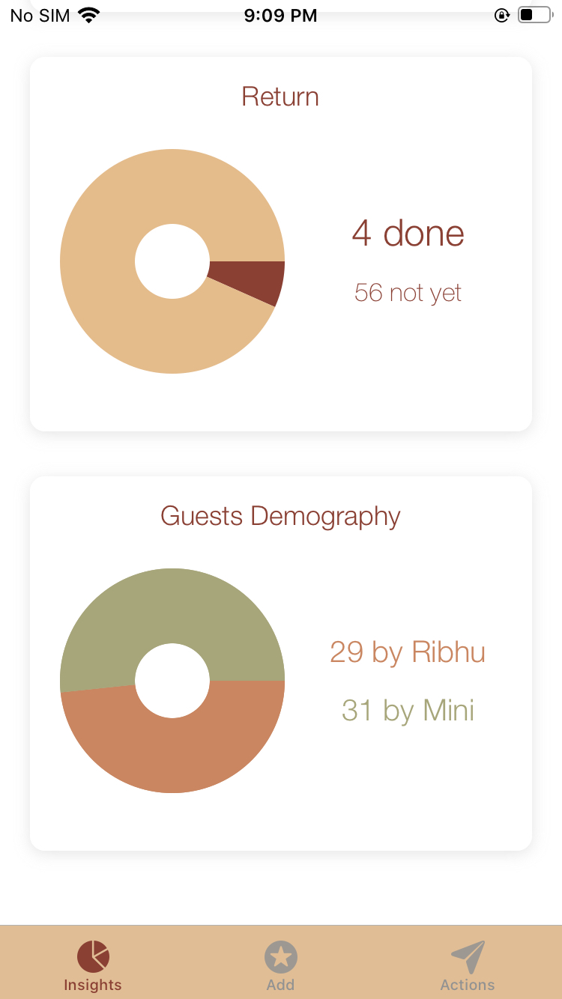
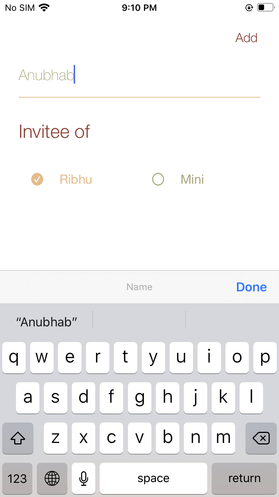
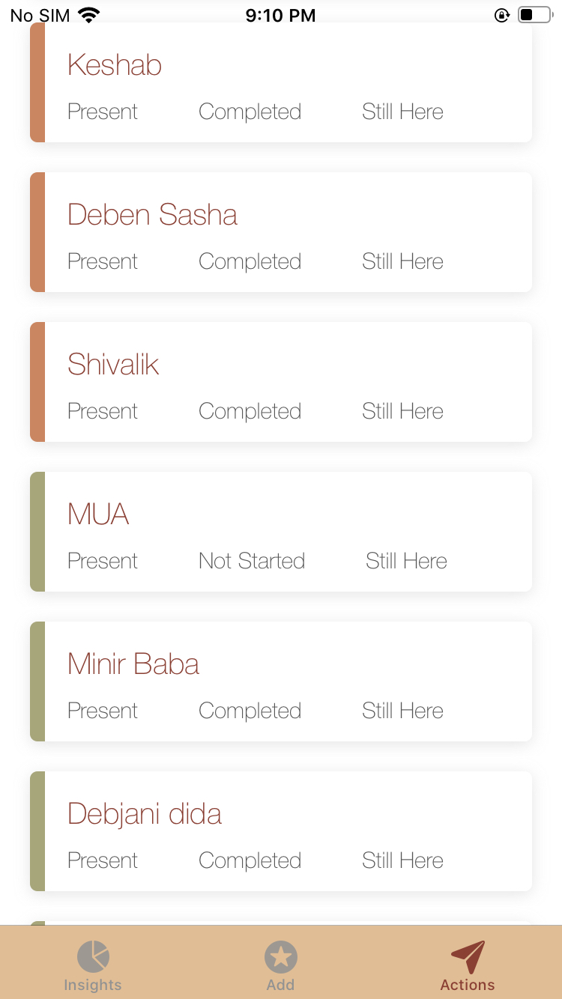

# Savour

Savour is a simple event management application built for personal usage. It can be a guide for basic learning of 

  - UI
  - Pie charts
  - Coredata
  - iCloud sync of offline data

# New Features!

  - CloudKit

For help and other assistance in cloud kit please go through:
  - [Syncing data on iOS devices with CoreData and CloudKit](https://medium.com/apple-developer-academy-federico-ii/syncing-data-on-ios-devices-with-coredata-and-cloudkit-bed296fc26e0)
  - [Core Data with Swift 4 for Beginners](https://medium.com/xcblog/core-data-with-swift-4-for-beginners-1fc067cca707)

### Insights

> Attendance and Dining Status

Attendance Pie Chart: Provides the glimpse of attendance count, not considering those who have already declined to be present in the event

Dining Status: Provides a quick glimpse of people who are left to dine.

> Return Status and Guest Demography

Return Status: Helps in identifying in a pie chart format how many people are goign to return and prepare the conierge service for the left.

Guest Demography: This helps in identifying the invitees are from whose side.

### Add Invitee

Allows user to update the guest names and easily manage invitee of one or more hosts

### All Invitee

Shows all invitee list and user can update status for each.

